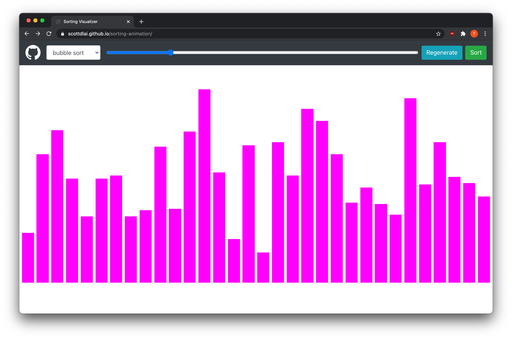

# Sorting Animation

This project will animate the steps of sorting algorithms. Currently, it can
animate 4 different algorithms (bubble sort, selection sort, merge sort, and
quick sort).

You can try it out [here](https://scottdlai.github.io/sorting-animation/)

## Usage

1. Drag the slider to change the number of bars

2. Choose a sorting algorithm

3. Click the `Sort` button. Once the animation starts, you can click the `Stop`
   button to pause the animation and then click `Sort` again to resume it.

4. (Optional) You can click `Regenerate` to generate a new array to sort again.

## Contributing

Feel free to fork this project and open a PR once you've done your changes :D.
